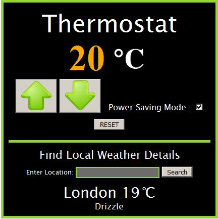

# Thermostat in Javascript

A simple digital thermostat, which can be launched by opening thermostat.html.

Specification
---

  - [x] Thermostat starts at 20 degrees
  - [x] You can increase the temp with the up button
  - [x] You can decrease the temp with the down button
  - [x] The minimum temperature is 10 degrees
  - [x] If power saving mode is on, the maximum temperature is 25 degrees
  - [x] If power saving mode is off, the maximum temperature is 32 degrees
  - [x] Power saving mode is on by default
  - [x] You can reset the temperature to 20 by hitting the reset button
  - [x] The thermostat should colour the display based on energy usage - <  18 is green, < 25 is yellow, otherwise red

Thermostat also includes an Open Weather API, which allows the user to input a location (town or city name) and returns the temperature and current weather conditions.

Technologies Used
---
* JavaScript
* jQuery
* Jasmine
* HTML
* CSS